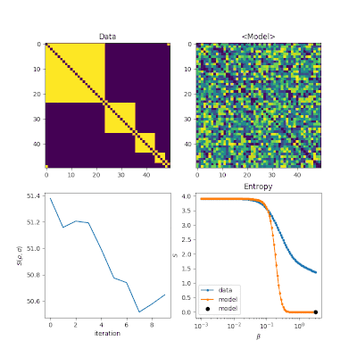

# Networkqit package

The spectral entropy framework
------------------------------

An information theoretic approach inspired by quantum statistical mechanics was recently proposed as a means 
to optimize network models and to assess their likelihood against synthetic and real-world networks.
Importantly, this method does not rely on specific topological features or network descriptors, 
but leverages entropy-based measures of network distance.
Entertaining the analogy with thermodynamics, **networkqit** provides a computational tool for the estimate of 
spectral entropy and fitting of model parameters.
These results enable the practical application of this novel and powerful framework to network model inference.

Documentation
-------------
The full documentation for this package under development and is currently being written, its current version is available at:

https://networkqit.github.io/

Installation
------------

To use the **networkqit** package we suggest to use `virtualenv`.
The **networkqit** package is pure Python, so it should work on Linux, Mac OSX and Windows.
Here we report instructions for usage in a standard Ubuntu linux installation.

How to install on Linux
-----------------------

1. Open a terminal, install `pip` and `virtualenv` and clone this repository
    
    
    cd
    sudo apt-get install python3-pip
    sudo pip3 install virtualenv
    virtualenv workspace
    cd workspace
    git clone https://bitbucket.org/carlonicolini/networkqit
    
2. You cloned the repository. Now start the virtualenv session.

    source bin/activate

3. If you are inside the `virtualenv` session, check that the Python version you are using is the one provided by `virtualenv`.

    which python3

4. Now install the networkqit package within the `virtualenv` environment.

    cd networkqit
    python3 setup.py sdist

Now install the created Python package, that should come with all its dependencies `matplotlib`, `numpy`, `networkx`, `pandas`, `numdifftools`, `bctpy`

    cd ..
    pip3 install networkqit/dist/networkqit-0.1.tar.gz 

Quick start
-----------

## Computing the spectral entropy of a network

Let us start by studying the spectral entropy of the density matrix of the famous karate club graph.
This example shows how to generate the spectral entropy plots shown in our main paper.

    import networkx as nx
    G = nx.karate_club_graph()
    A = nx.to_numpy_array(G)
    import networkqit as nq
    import numpy as np
    import matplotlib.pyplot as plt
    plt.style.use('ggplot')
    beta_range = np.logspace(-3,3,200)
    Sbeta = nq.batch_compute_vonneumann_entropy(L=nq.graph_laplacian(A),beta_range=beta_range)
    plt.semilogx(beta_range, Sbeta)
    plt.xlabel('$\\beta$')
    plt.ylabel('$S$')
    plt.title('Unnormalized spectral entropy')
    plt.show()

The spectral entropy is always in the range $[0,\log N]$, so if we simply divide by $\log N$ where $N$ is the number
of nodes, we renormalize it in the $[0,1]$ range.

## Generative network models

**networkqit** features a large number of network models, mainly those obtained from within the Maximum Entropy
framework. You can create a number of models and call methods on them by a consistent nomenclature:
Here we create an instance of the Undirected Binary Configuration model (UBCM), and sample 10 random networks from this
ensemble, based on the fitness parameters .. :math: x_i created at  random in the [0,1] domain.

    import networkqit as nq
    N=10
    model = nq.UBCM(N=10)
    xi = np.random.random([N,])
    adj_graphs = model.sample_adjacency(xi, batch_size=5)
    print(adj_graphs.shape)

The call returns a [5,N,N] numpy array, where the last two dimensions embed with the adjacency matrix of the 5 random graphs.
The method `sample_adjacency` is available for every generative model implemented in **networkqit** and is at the base  of the *maximize and sample* approach used for the optimization of the spectral entropy. 

## Model optimization

Networkqit can also work with network model fitting. The utilities to define model optimization are defined in the `algorithms` package.

The following lines describe an example describing optimization of the expected laplacian model.
We first create the object ErdosRenyi that describes the expected laplacian, adjacency and laplacian gradient with
respect to the only continuous parameters $p$.

    import networkx as nx
    import networkqit as nq
    import numpy as np
    G = nx.karate_club_graph()
    A = nx.to_numpy_array(G)
    L = nq.graph_laplacian(A)
    beta_range = np.logspace(-3,3,20)
    ermodel = nq.ErdosRenyi(N=len(A))

We can call the `ermodel` as if it is a simple function:

    print(ermodel([0.5]))

This returns the expected adjacency matrix, a 34x34 matrix with 0.5 off diagonal and 0 on diagonal.
The `ermodel` also allows to call methods like the expected laplacian or the expected laplacian gradient.

    print(ermodel.expected_laplacian_grad([0.5]))

Otherwise we can sample 10 independent networks from the Erdos-Renyi model, with the method `sample_adjacency`:

    print(ermodel.sample_adjacency([0.5]), batch_size=10)

Once the `ermodel` object is defined, we can use it within the `ContinuousOptimizer`.
We initialize the observed adjacency matrix as `A` and the initial solution `x0=np.array([0.2])`. It is important to define `x0` as a numpy array.
Finally the `beta_range` is a numpy array with the range of `beta` over which to optimize the model.

    solver = nq.ContinuousOptimizer(A=A, x0=np.array([0.2]), beta_range=beta_range)
    solver.setup(ermodel, ermodel.expected_laplacian_grad, step_callback=None)
    sol = solver.run()
    print(sol)

## Stochastic optimization of spectral entropy

Most of the models do not allow an analytical treatment of their spectral likelihood.
This involves knowing exact analytical formulations of the laplacian eigenvalues spectral density and this is still an unsolved problem for most of the useful network models.
To perform spectral likelihood optimization we can do stochastic optimization and find the parameters of the empirical graph such that the expected relative entropy averaged over the model ensemble 
is minimized. 
Doing this in **networkqit** is simple, as the library relies on the `autograd` package for the automatic calculation of complicated gradients of stochastic functions.

With the optimization method `Adam` which is borrowed from machine learning, we can optimize the expected relative entropy of the Erdos-Renyi model with respect to our model karate-club network,represented by **A** and see the effects of changing the inverse temperature parameter `beta` on the optimization process.

At every iteration, a `batch_size` number of random networks are sampled from the model, and their average spectral properties are used to compute an approximation to the expected relative entropy.
In this example we see how to optimze a model with `N (N-1)` free Bernoulli random variables that describe links in a graph.
At each stage in the `for` loop we replot the result, compared with the original network. We sample at each iteration of Adam a number of 32 independent networks, in order to form a good statistic for the calculation of the Laplacian spectrum.

    import matplotlib.pyplot as plt
    from autograd import numpy as np
    import networkqit as nq
    from networkqit import Adam
    A = nq.ring_of_custom_cliques([24,12,8])
    N = len(A)
    M = nq.IsingModel(N=N)
    L = nq.graph_laplacian(A)
    beta = 1
    opt = Adam(G=A, L=L, x0=np.random.random([N*N,]), model=M)
    rho = nq.compute_vonneuman_density(L=L, beta=beta)
    for rep in range(10):
        sol = opt.run(beta, learning_rate=1E-3, batch_size=32, maxiter=1000)
        nq.plot_mle(A, M.expected_adjacency(sol['x']))
        plt.show()

<!-- -->

# TODO

I would like to find someone helping in implementing XLA instead of autograd as the basic package for automatic differentiation. Indeed XLA has the possibility to extend calculations on the GPU and (in future) on MultiGPU or TPU systems, effortlessly. It would be possible to scale to much larger problems.

# Citing 
To cite **networkqit** please include the following publication in BibTeX format:

    @article{PhysRevE.98.022322,
      title = {Thermodynamics of network model fitting with spectral entropies},
      author = {Nicolini, Carlo and Vlasov, Vladimir and Bifone, Angelo},
      journal = {Phys. Rev. E},
      volume = {98},
      issue = {2},
      pages = {022322},
      numpages = {10},
      year = {2018},
      month = {Aug},
      publisher = {American Physical Society},
      doi = {10.1103/PhysRevE.98.022322},
      url = {https://link.aps.org/doi/10.1103/PhysRevE.98.022322}
    }

It is also vailable [at this link ](https://journals.aps.org/pre/abstract/10.1103/PhysRevE.98.022322)